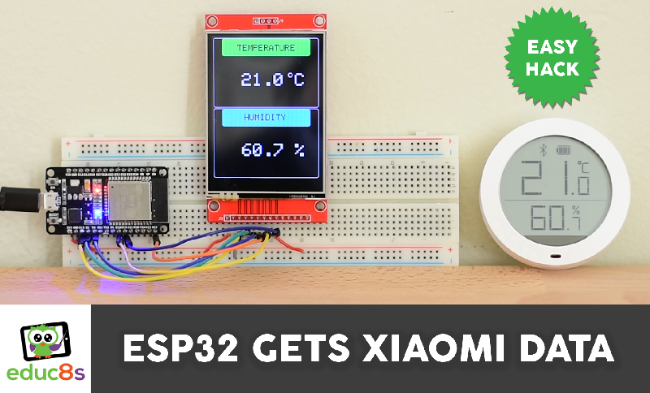
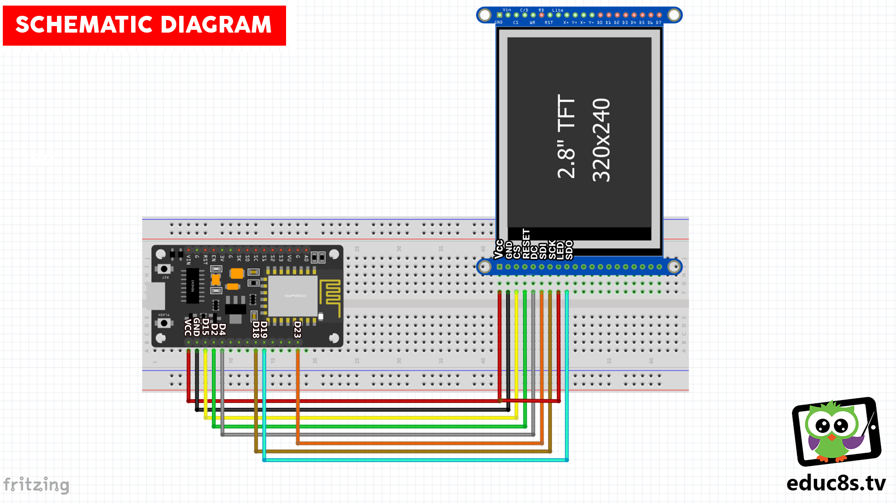

# ESP32_XIAOMI_MJ_HT_V1_BLUETOOTH_CONNECTION
 Get Temperature and Humidity readings from a Xiaomi MJ_HT_V1 device using ESP32 and an ILI9341 display
 
 

  

 
 🎥 Watch the detailed video: https://www.youtube.com/watch?v=Wef_bWNC2rY
 
 # Parts Needed

🛒 ESP32 ▶ http://educ8s.tv/part/ESP32

🛒 2.8" Display ▶ http://educ8s.tv/part/28ILI9341

🛒 Xiaomi Sensor ▶ http://educ8s.tv/part/XiaomiThermometer

🛒 Breadboard ▶ http://educ8s.tv/part/LargeBreadboard

🛒 Wires ▶ http://educ8s.tv/part/Wires

🛒 USB Meter ▶ http://educ8s.tv/part/UsbDoctorOLED

🛒 Powerbank ▶ http://educ8s.tv/part/Powerbank

💖 Full disclosure: All of the links above are affiliate links. I get a small percentage of each sale they generate. Thank you for your support!

# Schematic

  

# Credits & Thanks

  - Kudos to [Yeonho](https://github.com/turlvo) for being the creator of the KukuMI project without which this project would not exist.

